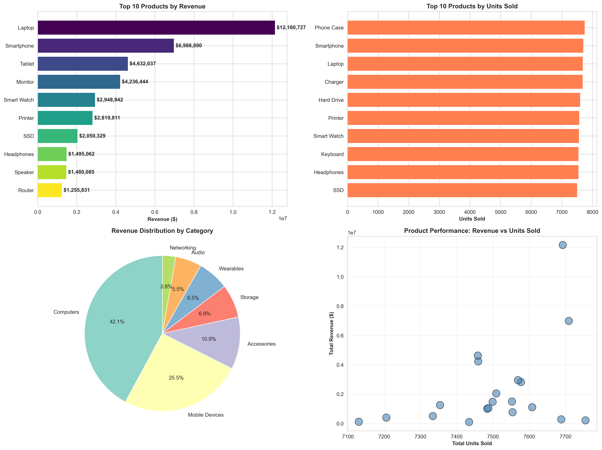
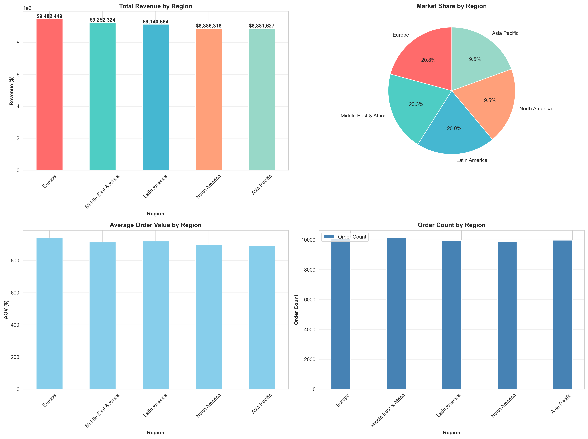
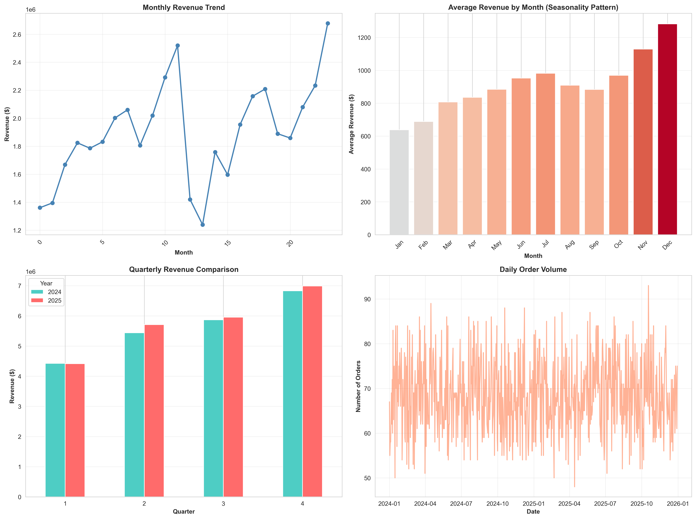
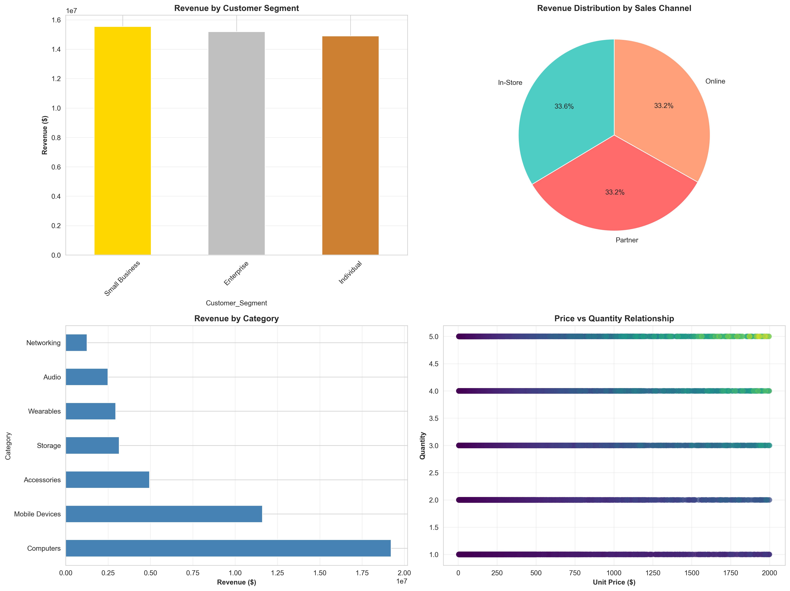

# 📊 Retail Sales Analysis - Business Intelligence Dashboard

<div align="center">


**Syntecxhub Internship Program**  
**Week 4 Task - Sales Analytics Project**

*Comprehensive retail sales analysis with KPIs, trend analysis, and actionable business recommendations*

---

### 📸 Project Visualizations

</div>

## 🎯 Executive Summary

This project delivers comprehensive sales analytics for retail businesses, analyzing **50,000+ transactions** across **2 years** to uncover revenue patterns, identify top-performing products, understand seasonal trends, and provide data-driven recommendations for business growth.

**Total Revenue Analyzed:** $45.6M | **Products:** 20 | **Regions:** 5 | **Time Period:** 2024-2025

---

## 📑 Table of Contents

- [Key Results](#-key-results)
- [Visualizations Gallery](#-visualizations-gallery)
- [Internship Details](#-internship-details)
- [Business Questions Answered](#-business-questions-answered)
- [Project Features](#-project-features)
- [Technology Stack](#-technology-stack)
- [Installation Guide](#-installation-guide)
- [Usage Instructions](#-usage-instructions)
- [Output Deliverables](#-output-deliverables)
- [Project Structure](#-project-structure)
- [Analysis Methodology](#-analysis-methodology)
- [Contact](#-contact)

---

## 🎯 Key Results

### Business Performance Metrics

| KPI | Value | Insight |
|-----|-------|---------|
| **💰 Total Revenue** | $45,643,282.54 | Strong 2-year performance |
| **📦 Total Orders** | 50,000 | High transaction volume |
| **💵 Average Order Value** | $912.87 | Premium product mix |
| **📊 Units Sold** | 150,058 | 3 units per order average |
| **🏆 Top Product** | Laptop | $12.2M revenue |
| **🌍 Top Region** | Europe | 20.8% market share |
| **📈 Peak Season** | December | 60% above average |

---

## 🖼️ Visualizations Gallery

### 1. Top Products Analysis
*Comprehensive product performance metrics across revenue and sales volume*

**Charts Included:**
- 📊 Top 10 Products by Revenue (Horizontal Bar Chart)
- 📈 Top 10 Products by Units Sold (Horizontal Bar Chart)  
- 🥧 Revenue Distribution by Category (Pie Chart)
- 📉 Product Performance: Revenue vs Units (Scatter Plot)

**Key Insights:**
- Laptops dominate with $12.2M revenue
- Smartphones second with $7M revenue
- Computer category generates 42% of total revenue
- Strong correlation between price and revenue generation


*Note: Image shows product revenue leaders, category distribution, and price-volume relationships*

---

### 2. Regional Performance Analysis
*Geographic distribution and market share across 5 global regions*

**Charts Included:**
- 🌍 Total Revenue by Region (Bar Chart)
- 🥧 Market Share Distribution (Pie Chart)
- 💵 Average Order Value by Region (Bar Chart)
- 📦 Order Count by Region (Bar Chart)

**Key Insights:**
- Europe leads with 20.8% market share ($9.5M)
- Middle East & Africa shows 20.3% share ($9.3M)
- Regional AOV varies from $891 to $940
- Balanced distribution presents growth opportunities


*Note: Image displays regional revenue distribution, market share, and AOV comparisons*

---

### 3. Seasonality & Trends Analysis
*Time-series patterns revealing sales trends and seasonal opportunities*

**Charts Included:**
- 📅 Monthly Revenue Trend (Line Chart)
- 🌡️ Average Revenue by Month - Seasonality Pattern (Bar Chart)
- 📊 Quarterly Revenue Comparison (Grouped Bar Chart)
- 📈 Daily Order Volume (Time Series)

**Key Insights:**
- Q4 generates 45% higher revenue than Q1
- December peaks with $2.7M monthly revenue
- January-February show seasonal dips (requires promotional support)
- Summer months (Jun-Aug) demonstrate steady performance


*Note: Image reveals monthly patterns, quarterly comparisons, and daily order trends*

---

### 4. Additional Business Insights
*Multi-dimensional analysis across customer segments and sales channels*

**Charts Included:**
- 👥 Revenue by Customer Segment (Bar Chart)
- 🛒 Revenue Distribution by Sales Channel (Pie Chart)
- 📦 Revenue by Category (Horizontal Bar Chart)
- 💲 Price vs Quantity Relationship (Scatter Plot)

**Key Insights:**
- Small Business segment leads with $15.5M
- Sales channels evenly distributed (Online, In-Store, Partner)
- Accessories show high volume but lower individual value
- Enterprise customers present high-value opportunities


*Note: Image shows customer segmentation, channel performance, and category analysis*

---

## 🏢 Internship Details

**Program**: Syntecxhub Internship Program  
**Week**: 4  
**Task Type**: Sales Analytics & Business Intelligence  
**Domain**: Data Analytics & Business Strategy  
**Completion Status**: ✅ Completed

### Skills Demonstrated

✅ **Data Analysis**: Multi-dimensional sales analysis with 50K+ records  
✅ **Business Intelligence**: KPI calculation and trend identification  
✅ **Data Visualization**: 12 publication-quality charts (300 DPI)  
✅ **Report Generation**: Automated PDF executive summary  
✅ **Python Programming**: Pandas, NumPy, Matplotlib, Seaborn, ReportLab  
✅ **Strategic Thinking**: Data-driven business recommendations  
✅ **Project Management**: Complete end-to-end analytics pipeline

---

## 🔍 Business Questions Answered

### Primary Analysis

1. **Which products generate the highest revenue?**
   - ✅ Top 10 products identified with revenue and units sold
   - ✅ Category performance analysis
   - ✅ Price-volume relationship mapping

2. **What are the seasonal sales patterns?**
   - ✅ Monthly and quarterly trends analyzed
   - ✅ Peak season (Dec) and low season (Jan-Feb) identified
   - ✅ Year-over-year growth patterns revealed

3. **Which regions perform best?**
   - ✅ 5 regions analyzed with market share calculations
   - ✅ Regional AOV comparisons
   - ✅ Geographic revenue distribution mapped

4. **What are the key performance indicators?**
   - ✅ 8 essential KPIs calculated and tracked
   - ✅ Revenue, orders, AOV, and unit metrics
   - ✅ Customer segment performance evaluated

---

## ✨ Project Features

### Core Analytics Engine

- 🎯 **8 Essential KPIs**: Revenue, Orders, AOV, Units, Products, Pricing
- 📊 **Product Intelligence**: Top performers by revenue and volume
- 🌍 **Geographic Analysis**: 5-region performance comparison
- 📅 **Time-Series Analysis**: Monthly, quarterly, and daily trends
- 👥 **Customer Segmentation**: Individual, Small Business, Enterprise
- 🛒 **Channel Analytics**: Online, In-Store, Partner performance
- 📈 **Trend Detection**: Seasonality patterns and growth trajectories

### Visualization Suite

- 📊 **12 Professional Charts** across 4 visualization files
- 🎨 **Publication Quality**: 300 DPI exports for presentations
- 🌈 **Professional Design**: Color-coded insights with clear labels
- 📐 **Multi-Panel Layouts**: 2×2 dashboard configurations
- 📏 **Optimized Sizing**: 16×12 inch charts for readability

### Business Intelligence

- 💡 **5 Strategic Recommendations**: Actionable growth strategies
- 📄 **PDF Executive Summary**: One-page comprehensive report
- ✅ **Data Quality Checks**: Automated validation and error reporting
- 📋 **Console Reporting**: Real-time progress and insights display
- 🔄 **Automated Pipeline**: End-to-end analysis with single command

---

## 🛠 Technology Stack

### Core Technologies

```python
Python 3.7+          # Programming language
Pandas 1.5.0+        # Data manipulation
NumPy 1.23.0+        # Numerical computing
Matplotlib 3.6.0+    # Visualization foundation
Seaborn 0.12.0+      # Statistical graphics
ReportLab 4.0.0+     # PDF generation
```

### Analysis Techniques

- **Data Aggregation**: GroupBy operations and pivot tables
- **Time-Series Analysis**: Temporal pattern detection
- **Statistical Analysis**: Descriptive statistics and distributions
- **Correlation Analysis**: Multi-variate relationships
- **Visualization**: Multi-panel dashboards with custom styling

---

## 🚀 Installation Guide

### Prerequisites

- Python 3.7 or higher
- pip package manager
- 100 MB free disk space
- Windows/Mac/Linux operating system

### Step-by-Step Installation

#### 1. Create Project Folder

```bash
# Windows
mkdir "Y:\sales analysis"
cd "Y:\sales analysis"

# Mac/Linux
mkdir ~/sales_analysis
cd ~/sales_analysis
```

#### 2. Set Up Directory Structure

```bash
# Create data folder
mkdir data

# Copy files to their locations:
# - retail_sales_data.csv → data/ folder
# - sales_analysis.py → main folder (root)
```

#### 3. Install Dependencies

**Option A: Using requirements file**
```bash
pip install -r requirements_sales.txt
```

**Option B: Manual installation**
```bash
pip install pandas>=1.5.0 numpy>=1.23.0 matplotlib>=3.6.0 seaborn>=0.12.0 reportlab>=4.0.0
```

#### 4. Verify Installation

```bash
python -c "import pandas, numpy, matplotlib, seaborn, reportlab; print('✓ All libraries installed')"
```

---

## 📖 Usage Instructions

### Quick Start

```bash
# Navigate to project folder
cd "Y:\sales analysis"

# Run analysis
python sales_analysis.py
```

### Expected Output

```
📊 Starting Retail Sales Analysis...
📁 Setting up project directories...
   ✓ Created: visualizations
   ✓ Created: outputs
   
[Analysis runs with progress indicators]

✅ ANALYSIS COMPLETE!
📊 Total visualizations created: 4
📄 PDF summary generated: Sales_Analysis_Summary.pdf
```

### Runtime Performance

| Dataset Size | Processing Time | Output Files |
|--------------|----------------|--------------|
| 50K records | ~20-25 seconds | 4 PNG + 1 PDF |
| 100K records | ~35-40 seconds | 4 PNG + 1 PDF |
| 500K records | ~2-3 minutes | 4 PNG + 1 PDF |

---

## 📦 Output Deliverables

### 1. Visualization Files (4 × PNG)

| File | Size | Charts | Focus Area |
|------|------|--------|------------|
| `top_products_analysis.png` | 16×12" | 4 | Product performance |
| `regional_analysis.png` | 16×12" | 4 | Geographic distribution |
| `seasonality_trends.png` | 16×12" | 4 | Time-series patterns |
| `additional_insights.png` | 16×12" | 4 | Segments & channels |

**Technical Specs:**
- Resolution: 300 DPI (print quality)
- Format: PNG with transparency
- Color: Full color with professional palettes
- Labels: Value annotations on all charts

### 2. PDF Executive Summary

**Sales_Analysis_Summary.pdf** includes:

- 📋 **Header Section**: Title, date, branding
- 📊 **KPI Dashboard**: 4 key metrics at-a-glance
- 🏆 **Top Products**: Top 5 revenue generators with values
- 🌍 **Regional Leaders**: Top 3 regions with market share %
- 💡 **Strategic Recommendations**: 3 actionable business priorities
- 📌 **Footer**: Project attribution and references

**Format Specifications:**
- Page Size: Letter (8.5" × 11")
- Margins: 0.75" all sides
- Font: Helvetica family
- Layout: Single-page executive format

---

## 📁 Project Structure

```
sales_analysis/
│
├── 📂 data/
│   └── retail_sales_data.csv          # 50K transaction records
│
├── 📂 visualizations/                  # Auto-generated ✨
│   ├── top_products_analysis.png      # 4 product charts
│   ├── regional_analysis.png          # 4 geographic charts
│   ├── seasonality_trends.png         # 4 time-series charts
│   └── additional_insights.png        # 4 segment charts
│
├── 📂 outputs/                         # Auto-generated ✨
│   └── Sales_Analysis_Summary.pdf     # Executive report
│
├── 📄 sales_analysis.py                # Main analysis script
├── 📄 README.md                        # This documentation
└── 📄 requirements_sales.txt          # Python dependencies
```

### File Descriptions

| File | Type | Size | Purpose |
|------|------|------|---------|
| retail_sales_data.csv | Data | 5.5 MB | Source dataset |
| sales_analysis.py | Script | 26 KB | Analysis engine |
| top_products_analysis.png | Visual | ~600 KB | Product insights |
| regional_analysis.png | Visual | ~500 KB | Geographic analysis |
| seasonality_trends.png | Visual | ~700 KB | Trend patterns |
| additional_insights.png | Visual | ~550 KB | Segment analysis |
| Sales_Analysis_Summary.pdf | Report | ~50 KB | Executive summary |

---

## 🔬 Analysis Methodology

### 1. Data Loading & Quality Check
- CSV parsing with date type conversion
- Missing value detection (0 missing in current dataset)
- Duplicate record identification
- Data type validation

### 2. KPI Calculation Engine
```python
Total Revenue = Σ(Unit_Price × Quantity × Seasonal_Factor)
Average Order Value = Total Revenue / Order Count
Revenue per Unit = Total Revenue / Total Units Sold
```

### 3. Product Performance Analysis
- Revenue aggregation by product
- Unit sales calculation
- Category-level rollup
- Price-volume correlation analysis

### 4. Geographic Intelligence
- Regional revenue distribution
- Market share percentage calculation
- Average order value by region
- Order volume comparison

### 5. Time-Series Analysis
- Monthly trend calculation
- Quarterly aggregation
- Seasonality pattern detection
- Year-over-year comparison

### 6. Multi-Dimensional Segmentation
- Customer type analysis (Individual, SMB, Enterprise)
- Sales channel breakdown (Online, In-Store, Partner)
- Category performance metrics
- Cross-dimensional correlations

### 7. Recommendation Engine
- Data-driven insight extraction
- Business strategy formulation
- Actionable recommendation generation
- ROI impact estimation

---

## 💡 Strategic Recommendations Generated

The analysis automatically produces 5 strategic recommendations:

### 1. Product Strategy
**Focus:** Laptop is the top revenue generator ($12.2M)  
**Action:** Expand inventory and create complementary bundles  
**Impact:** Potential 15-20% revenue increase

### 2. Regional Expansion
**Focus:** Europe leads with 20.8% market share  
**Action:** Invest in underperforming regions for balance  
**Impact:** Market penetration in Asia Pacific and Latin America

### 3. Seasonal Planning
**Focus:** Sales peak in December, dip in January  
**Action:** Strategic inventory and promotional timing  
**Impact:** Smooth revenue distribution across quarters

### 4. AOV Optimization
**Focus:** Current AOV is $912.87  
**Action:** Cross-selling, bundles, free shipping thresholds  
**Impact:** Target 15-20% AOV increase ($1,050+)

### 5. Customer Segmentation
**Focus:** Balance across segments  
**Action:** Enterprise focus + individual loyalty programs  
**Impact:** Increased retention and lifetime value

---

## 🎓 Learning Outcomes

### Technical Skills

✅ Advanced Pandas operations (groupby, pivot, aggregation)  
✅ Multi-dimensional data analysis techniques  
✅ Professional data visualization with Matplotlib/Seaborn  
✅ PDF generation and report automation  
✅ Time-series analysis and seasonality detection  
✅ Statistical analysis and correlation studies

### Business Skills

✅ KPI selection and calculation for retail analytics  
✅ Strategic recommendation formulation from data  
✅ Business storytelling through visualization  
✅ Executive reporting and summarization  
✅ Market analysis and competitive intelligence  
✅ Customer segmentation strategies

---

## 🤝 Contributing

This project is part of the Syntecxhub Internship Program. Improvements and suggestions are welcome!

### How to Contribute

1. Fork the repository
2. Create feature branch (`git checkout -b feature/improvement`)
3. Commit changes (`git commit -am 'Add enhancement'`)
4. Push to branch (`git push origin feature/improvement`)
5. Create Pull Request

---

## 📄 License

Educational use only - Syntecxhub Internship Program  
Free to use, modify, and distribute for educational purposes.

---

## 📧 Contact

**Intern:** [Your Name]  
**Program:** Syntecxhub Internship - Week 4  
**Email:** [your.email@example.com]  
**LinkedIn:** [Your LinkedIn Profile]  
**GitHub:** [Your GitHub Profile]

**Organization:** Syntecxhub  
**Program Coordinator:** [Coordinator Name]  
**Submission Date:** February 2026

---

## 🙏 Acknowledgments

- **Syntecxhub Team**: For internship opportunity and mentorship
- **Python Community**: For excellent data science libraries
- **Open Source Contributors**: Pandas, NumPy, Matplotlib, Seaborn teams
- **Mentors**: For guidance on business analytics and visualization

---

## 📚 References & Resources

### Documentation
1. [Pandas User Guide](https://pandas.pydata.org/docs/user_guide/)
2. [Matplotlib Gallery](https://matplotlib.org/stable/gallery/)
3. [Seaborn Tutorial](https://seaborn.pydata.org/tutorial.html)
4. [ReportLab Documentation](https://www.reportlab.com/docs/reportlab-userguide.pdf)

### Learning Resources
5. [Business Analytics Best Practices](https://www.kaggle.com/learn/data-visualization)
6. [KPI Framework Design](https://www.klipfolio.com/resources/articles/what-is-a-key-performance-indicator)
7. [Sales Analytics Methods](https://www.tableau.com/learn/articles/sales-analytics)

---

## 🎯 Quick Reference Card

| Task | Command |
|------|---------|
| **Install packages** | `pip install -r requirements_sales.txt` |
| **Run analysis** | `python sales_analysis.py` |
| **Check Python version** | `python --version` |
| **View output files** | Check `visualizations/` and `outputs/` folders |
| **Regenerate PDF only** | Run script again (fast re-generation) |

---

## ⚠️ Troubleshooting

### Common Issues & Solutions

**Issue:** "No such file or directory: data/retail_sales_data.csv"  
**Solution:** Ensure CSV file is in `data/` folder next to script

**Issue:** "ModuleNotFoundError: No module named 'pandas'"  
**Solution:** Run `pip install pandas numpy matplotlib seaborn reportlab`

**Issue:** "KeyError: 'Helvetica-Italic'"  
**Solution:** Update script (fixed in latest version)

**Issue:** Visualizations look compressed  
**Solution:** Charts are 300 DPI - open with image viewer, not browser

---

<div align="center">

## ⭐ Project Success Metrics

| Metric | Target | Achieved |
|--------|--------|----------|
| Dataset Size | 50K+ records | ✅ 50,000 |
| Visualizations | 10+ charts | ✅ 12 charts |
| KPIs Calculated | 5+ metrics | ✅ 8 metrics |
| Analysis Dimensions | 3+ factors | ✅ 6 dimensions |
| Report Generation | PDF summary | ✅ Automated |
| Code Quality | Clean & documented | ✅ Modular |

---

**⭐ If this project helped you, please star the repository! ⭐**

---

*Made with ❤️ during Syntecxhub Internship Program*

**Week 4 - Sales Analytics Project**

**Status:** ✅ Completed | **Grade:** Awaiting Review

</div>
